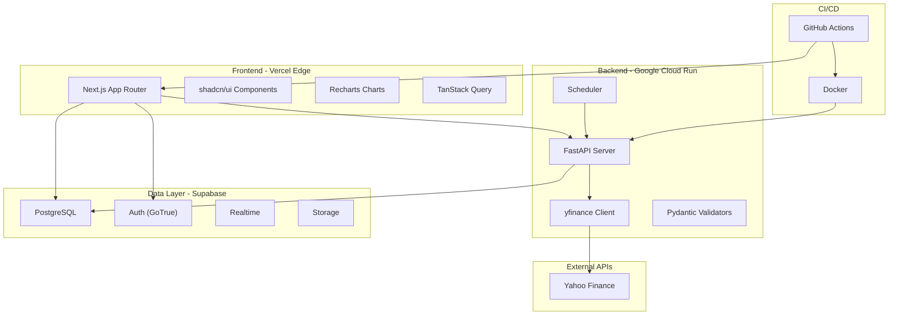
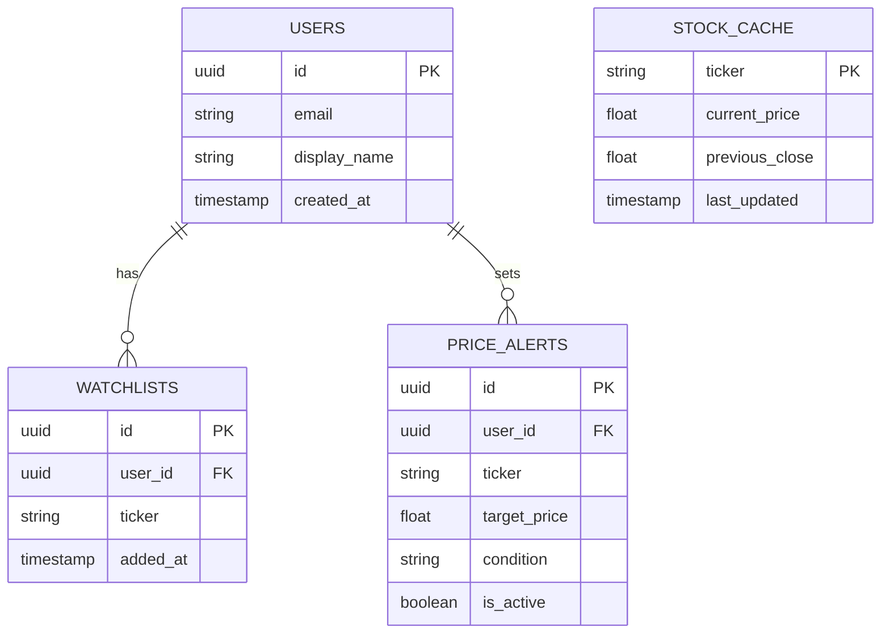
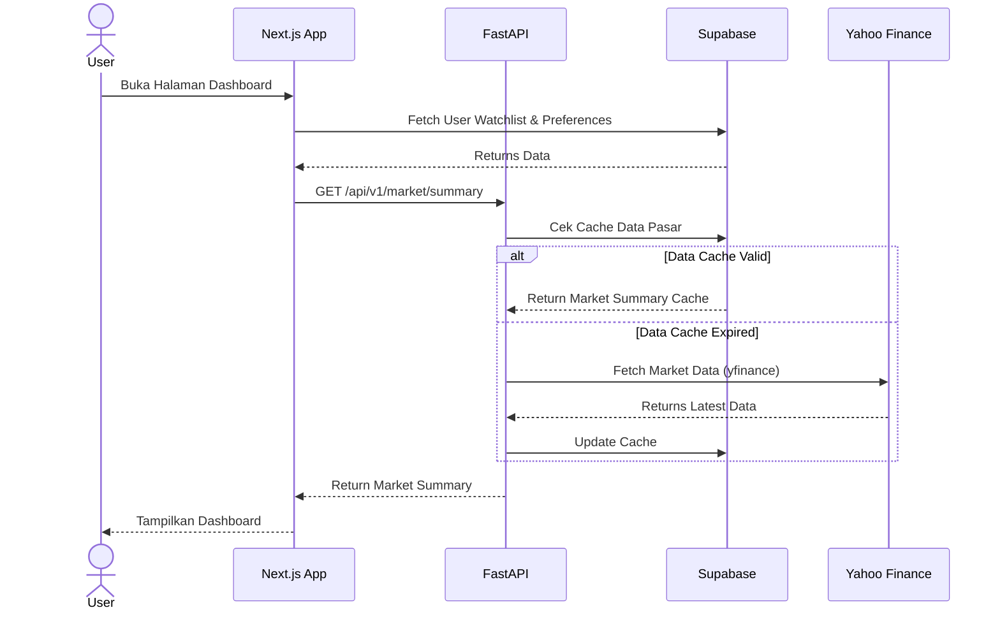
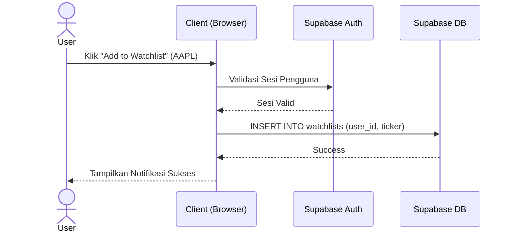
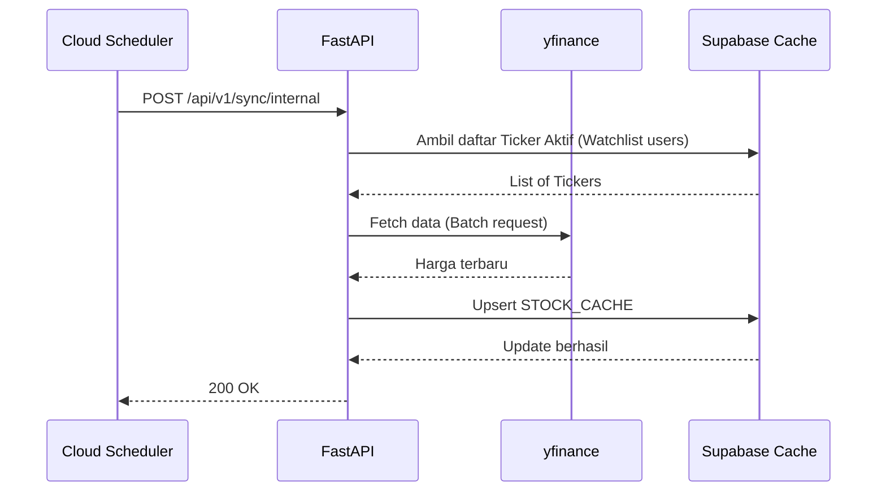
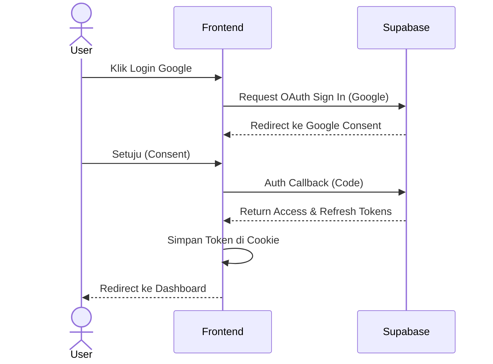
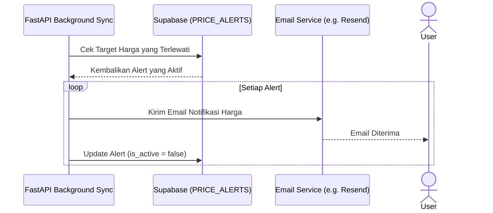

# Architecture Document - StockPulse (Real-Time Stock Market Watcher)

## 1. System Architecture Overview

Dokumen ini mendeskripsikan arsitektur sistem secara keseluruhan untuk StockPulse. Sistem ini mengadopsi pola modern serverless dan cloud-native architecture, memanfaatkan Vercel untuk frontend, Google Cloud Run untuk backend, dan Supabase untuk lapisan data.



## 2. Component Architecture

### Frontend Architecture
Arsitektur frontend dibangun menggunakan **Next.js App Router** untuk mendukung *Server-Side Rendering* (SSR) dan *Static Site Generation* (SSG).

- **Page Structure (App Router)**: Menggunakan paradigma nested routing, layouts, dan error boundaries.
- **Component Hierarchy**:
  - `Pages`: Container level atas yang mengambil data sisi server jika diperlukan.
  - `Features`: Komponen yang spesifik terhadap domain (misal: `StockChart`, `WatchlistGrid`).
  - `UI/Elements`: Komponen *reusable* dari shadcn/ui dan Magic UI.
- **State Management Flow**: Kombinasi antara React Context untuk UI state, dan TanStack Query untuk server state.
- **Data Fetching Patterns**: Memanfaatkan `fetch` API Next.js dengan ISR (*Incremental Static Regeneration*) untuk data statis, dan TanStack Query untuk data real-time di client-side.
- **Route Structure**:
  - `/` (Dashboard): Tinjauan pasar (market overview), indeks utama, dan tren saham.
  - `/stocks/[ticker]`: Tampilan detail saham spesifik, dengan grafik intraday/historical interaktif.
  - `/watchlist`: Daftar saham pantauan pengguna (user's watchlist).
  - `/settings`: Preferensi notifikasi, tema UI, dan pengaturan akun.

### Backend Architecture
Backend diimplementasikan dengan **Python (FastAPI)** dan berjalan di **Google Cloud Run**.

- **API Layer Structure**: Endpoints RESTful yang modular, dikelompokkan berdasarkan domain resource (e.g., `/api/v1/stocks`, `/api/v1/users`).
- **Service Layer Pattern**: Logika bisnis dipisahkan dari controller/router. Service `yfinance` diabstraksi agar mudah diganti jika diperlukan.
- **Repository Pattern**: Mengisolasi logika akses data (ORM/Supabase Client) dari business logic.
- **Background Job Architecture**: Menggunakan scheduler internal atau Cloud Scheduler untuk trigger endpoint `sync` yang memperbarui data saham populer secara asinkron.
- **Error Handling Middleware**: Exception handlers global yang menangkap error dan mengembalikan respons HTTP seragam dengan Pydantic models.

### Data Architecture
Data persisten dikelola oleh **Supabase (PostgreSQL)**.

#### Entity Relationship Diagram


- **Data Flow**: Frontend dapat membaca langsung dari Supabase (via Supabase-js untuk data *user-specific*) atau via FastAPI untuk data pasar.
- **Caching Architecture**: Data saham yang sering diminta akan di-*cache* dalam tabel `STOCK_CACHE` di Supabase untuk mengurangi request rate limit ke yfinance.
- **Data Freshness**: Tabel cache memiliki TTL (Time-To-Live). Jika data kadaluwarsa (>15 menit), FastAPI akan memicu pembaruan background ke Yahoo Finance.

## 3. Sequence Diagrams

### 3.1 User Loading Dashboard


### 3.2 Adding Stock to Watchlist


### 3.3 Background Data Refresh Cycle


### 3.4 User Authentication Flow


### 3.5 Price Alert Trigger Flow


## 4. Infrastructure Architecture

- **Network Topology**: Frontend di-deploy di Vercel Edge Network. Backend di Cloud Run (GCP). Supabase berjalan pada infrastruktur AWS.
- **CDN & Edge Caching**: Aset statis dan halaman SSR/SSG di-cache di Vercel Edge Network. *Stale-While-Revalidate* digunakan untuk performa tinggi.
- **Container Architecture**: FastAPI di-*containerize* dengan Docker. Image berukuran kecil dengan Alpine/Slim base image.
- **Auto-scaling Behavior**: Cloud Run dikonfigurasi untuk auto-scale dari 0 hingga *max instances* (misal 5, untuk Free Tier).
- **Cold Start Mitigation Strategies**:
  - Backend: Menggunakan CPU boost pada Cloud Run saat inisiasi, mempertahankan minimal 1 *idle instance* jika budget memungkinkan, atau menggunakan cron job *keep-alive* (ping).
  - Frontend: Edge functions mengurangi *latency* awal, SSR pages di-*cache*.

## 5. Data Flow Architecture

- **Data Pipeline**:
  1. **Yahoo Finance -> FastAPI**: FastAPI menggunakan `yfinance` library untuk fetch data secara periodik. Validasi data masuk dengan Pydantic.
  2. **FastAPI -> Supabase**: Data divalidasi kemudian di-*upsert* ke Supabase PostgreSQL database untuk persistent cache.
  3. **Supabase -> Next.js**: Frontend dapat fetch data dari API FastAPI atau langsung via PostgREST endpoint Supabase jika data bersifat CRUD biasa (seperti watchlist).
- **Caching at each layer**:
  - HTTP cache pada sisi klien dan Vercel (CDN).
  - Database table (`STOCK_CACHE`) sebagai *application-level cache*.
- **Error recovery**: Implementasi *Exponential Backoff* saat fetching dari yfinance, dan failover ke cached data lama jika source gagal.

## 6. State Management Architecture

- **Server State (TanStack Query)**: Mengelola state asynchronous. Melakukan fetching data market, caching, dan automatic background refetching.
- **Client State (Zustand atau Context)**: Mengelola state UI global seperti toggle *Dark/Light Mode* atau status sidebar (buka/tutup).
- **URL State (searchParams)**: State yang harus dapat dibagikan (*shareable*), contohnya: filter saham, rentang tanggal chart, parameter pencarian, disimpan di URL (Next.js `useSearchParams`).
- **Form State**: *React Hook Form* terintegrasi dengan `zod` untuk validasi sisi klien sebelum data disubmit.
- **Cache Invalidation Strategy**: TanStack Query menggunakan `queryKey` spesifik. Mutasi seperti penambahan watchlist akan me-trigger `queryClient.invalidateQueries({ queryKey: ['watchlist'] })`.

## 7. Error Handling Architecture

- **Frontend Error Boundaries**: Next.js `error.tsx` pada setiap *route segment* menahan kerusakan UI agar aplikasi tetap bisa beroperasi, menampilkan *fallback UI*.
- **API Error Responses**: FastAPI mengembalikan struktur JSON standar: `{"error": "message", "code": 404}` menggunakan custom exception handlers.
- **Retry Strategies**: TanStack Query dikonfigurasi untuk melakukan 3 kali retry secara eksponensial (khusus untuk error network 5xx).
- **Fallback UI Patterns**: Menggunakan Skeleton loaders dari shadcn/ui ketika data *loading* atau ketika terjadi *partial fetch failure*.
- **Circuit Breaker Pattern**: Jika yfinance down secara beruntun, FastAPI menahan request (Circuit Open) dan mereturn data dari cache Supabase dengan warning HTTP headers (Data is stale).

## 8. Scalability Architecture

- **Horizontal Scaling Strategy**: Cloud Run (Backend) & Vercel (Frontend) sepenuhnya *stateless* dan otomatis menskalakan container secara horizontal berdasarkan request load.
- **Database Connection Pooling**: Supabase PgBouncer (Transaction mode) memastikan limit koneksi Postgres tidak terkuras habis saat traffic tinggi.
- **API Rate Limit Management**: FastAPI mengimplementasikan *SlowAPI* (Redis based / In-memory) untuk membatasi request per IP per menit.
- **Cache Warming Strategies**: Scheduler dijalankan 10 menit sebelum jam buka bursa Wall Street (09:30 EST) untuk mem-*populate* cache saham dominan (seperti S&P 500).
- **CDN Utilization**: Endpoint API statis (*historical data*) dikonfigurasi dengan headers `Cache-Control: public, s-maxage=3600` agar bisa di-*serve* oleh CDN.

## 9. Folder Structure

### 9.1 Frontend (Next.js)
```text
stock-market-watcher/
├── frontend/
│   ├── src/
│   │   ├── app/                 # Next.js App Router pages
│   │   │   ├── (auth)/          # Authentication routes (login, register)
│   │   │   ├── dashboard/       # Dashboard routes
│   │   │   ├── stocks/[ticker]/ # Individual stock details
│   │   │   └── layout.tsx       # Root layout
│   │   ├── components/          # React components
│   │   │   ├── ui/              # shadcn/ui standard components
│   │   │   ├── magicui/         # Magic UI animations
│   │   │   ├── charts/          # Recharts wrappers
│   │   │   └── features/        # Domain-specific components
│   │   ├── hooks/               # Custom React hooks
│   │   ├── lib/                 # Utility functions, API clients
│   │   ├── types/               # TypeScript definitions
│   │   └── stores/              # Zustand state management
│   ├── public/                  # Static assets
│   ├── tailwind.config.ts       # Tailwind CSS config
│   └── package.json
```

### 9.2 Backend (FastAPI)
```text
stock-market-watcher/
├── backend/
│   ├── app/
│   │   ├── api/                 # API routers and endpoints
│   │   │   └── v1/              # API versioning
│   │   ├── core/                # Config, security, exceptions
│   │   ├── models/              # Pydantic schemas for request/response
│   │   ├── services/            # Business logic and external API calls
│   │   ├── db/                  # Supabase client / DB connection
│   │   └── main.py              # Application entry point
│   ├── tests/                   # Pytest suite
│   ├── Dockerfile               # Containerization definition
│   └── requirements.txt         # Python dependencies
├── docs/                        # Project documentation (ADRs, Architecture)
└── .github/                     # CI/CD Actions workflows
```

## 10. Technology Decision Records (ADRs)

### ADR 1: Pemilihan Framework Frontend
- **Context**: Membutuhkan framework UI yang SEO-friendly, memiliki ekosistem yang luas, cepat untuk prototipe, dan gratis untuk hosting.
- **Decision**: Menggunakan **Next.js (App Router)**.
- **Consequences**: Waktu kurva pembelajaran App Router, memecahkan permasalahan SEO/Performance, serta mudah diintegrasikan dengan edge network (Vercel).
- **Alternatives Considered**: React SPA (Vite) - ditolak karena tantangan SEO dan struktur routing eksternal.

### ADR 2: Backend Language & Framework
- **Context**: Perlu membangun API untuk memproses data finansial dari Yahoo Finance (yfinance library ditulis di Python).
- **Decision**: Menggunakan **Python (FastAPI)**.
- **Consequences**: Eksekusi asinkron sangat cepat, dokumentasi otomatis via Swagger UI, dan *seamless integration* dengan ekosistem data science Python.
- **Alternatives Considered**: Node.js/Express - ditolak karena porting yfinance ke Node.js sulit dan kurang andal dibandingkan *library native* Python.

### ADR 3: Database Provider
- **Context**: Memerlukan *relational database* dengan dukungan *realtime*, *authentication*, dan Free Tier yang cukup luas.
- **Decision**: Menggunakan **Supabase (PostgreSQL)**.
- **Consequences**: Mendapatkan Auth, API otomatis (PostgREST), Realtime features dari satu platform. Vendor lock-in sebagian kecil pada auth/realtime API mereka.
- **Alternatives Considered**: Neon.tech - ditolak karena perlu membuat sistem auth dan storage sendiri, meskipun unggul di *serverless scaling*.

### ADR 4: UI Component Library
- **Context**: Butuh *build-time* yang cepat tanpa perlu styling dari awal, namun juga harus *highly customizable* (*vibe-coding-friendly*).
- **Decision**: Menggunakan **shadcn/ui + Magic UI** berbasis Tailwind CSS.
- **Consequences**: Aksesibilitas terjamin (Radix UI), desain konsisten, komponen disalin (copy/paste) langsung ke dalam source code, dan tidak ada dependensi library komponen raksasa (bloat).
- **Alternatives Considered**: MUI / Chakra UI - ditolak karena berat, opinionated, dan sulit melakukan customisasi tanpa over-riding tema default yang kompleks.
