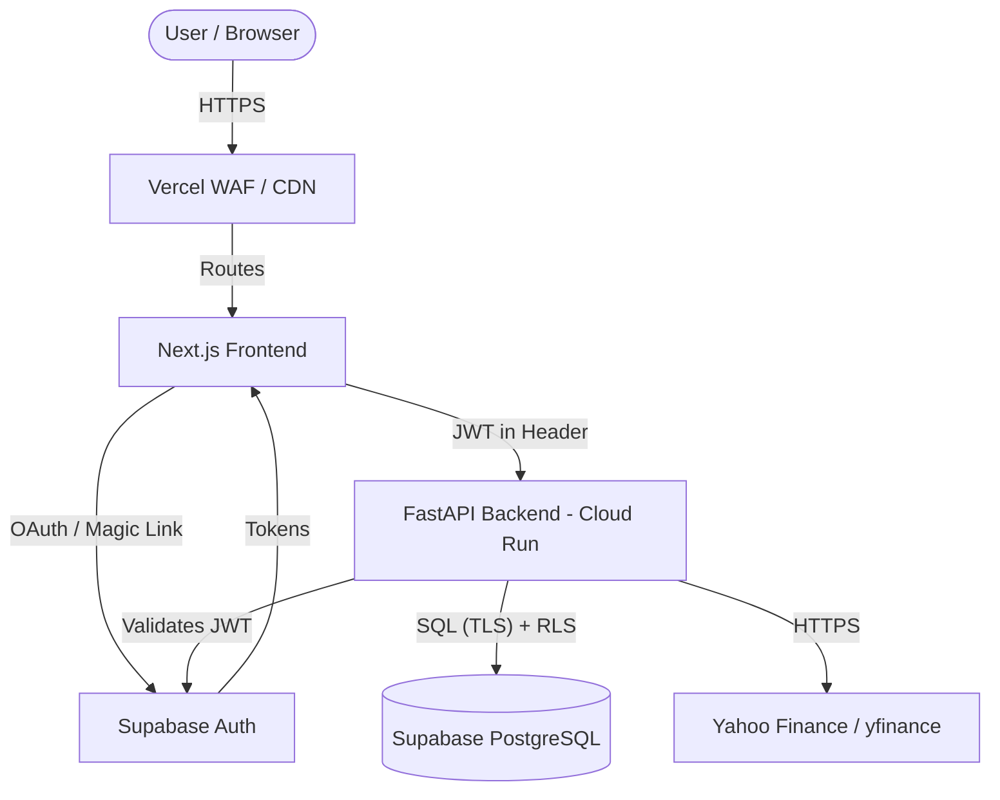

# StockPulse - Security Architecture & Policies

## 1. Security Architecture Overview



## 2. Authentication & Authorization
- **Provider**: Supabase Auth (handles users, sessions, and token issuance).
- **Flows**: 
  - OAuth 2.0 (Google Workspace / Gmail).
  - Magic Link (Passwordless email authentication).
- **Token Management**: JWTs are stored in HTTP-only cookies (if SSR) or secure local storage (if strict SPA), with short expiry times (e.g., 1 hour).
- **Refresh Strategy**: Handled via Supabase JS SDK silent refresh before token expiry.
- **Authorization (RLS)**: Row Level Security is enforced at the PostgreSQL database level.
  - Users can only `SELECT`, `INSERT`, `UPDATE`, `DELETE` rows in the `watchlists` or `portfolios` tables where `user_id = auth.uid()`.

## 3. API Security
- **CORS**: Configured in FastAPI to strictly allow only the Vercel production domain and `localhost:3000` for development. `allow_credentials=True` for authenticated sessions.
- **Rate Limiting**: 
  - FastAPI backend utilizes IP-based rate limiting (e.g., 100 req/min).
  - External API (Yahoo Finance) polling is throttled via background caching (Redis or in-memory) to prevent upstream bans.
- **Input Validation**: 
  - Frontend: `Zod` schemas for all forms and API payloads.
  - Backend: `Pydantic` models in FastAPI validate all incoming JSON payloads and query parameters.
- **Injection Prevention**: Supabase client uses parameterized queries. Raw SQL is strictly avoided.
- **CSRF**: Supabase auth tokens mitigate CSRF when used via Authorization headers.

## 4. Data Security
- **Data Classification**:
  - *Public Data*: Stock prices, metadata (Cached, no auth required to view generalized data).
  - *Private User Data*: Email, Watchlists, Settings (Strict RLS, Auth required).
- **Encryption**: 
  - At Rest: Supabase uses AES-256 for PostgreSQL data.
  - In Transit: TLS 1.3 enforced on all Vercel, Cloud Run, and Supabase connections.
- **PII Handling**: We store minimal PII (only email address).
- **Data Retention**: Unverified users deleted after 30 days. User account deletion triggers cascade delete of all associated data.

## 5. Infrastructure Security
- **Vercel**: Branch protection rules, preview deployments restricted, Edge WAF enabled.
- **Cloud Run (FastAPI)**:
  - Deployed behind Google Cloud API Gateway or Load Balancer.
  - Invocation restricted to authenticated Vercel origins (using service accounts or strict CORS).
- **Docker Security**:
  - `FROM python:3.11-slim`
  - Run as non-root user (`USER myappuser`).
  - Read-only file system where possible.
- **Secrets Management**: 
  - GCP Secret Manager for Cloud Run variables.
  - Vercel Environment Variables for frontend.

## 6. Environment Variables Security
Strict separation of environments (Development, Preview, Production).

**Frontend (.env.local)**:
```env
NEXT_PUBLIC_SUPABASE_URL=https://[PROJECT_REF].supabase.co
NEXT_PUBLIC_SUPABASE_ANON_KEY=[ANON_KEY]
NEXT_PUBLIC_API_URL=https://api.stockpulse.app
```
*(Note: `NEXT_PUBLIC_` variables are exposed to the browser. Never place secrets here.)*

**Backend (.env)**:
```env
SUPABASE_URL=https://[PROJECT_REF].supabase.co
SUPABASE_SERVICE_ROLE_KEY=[SERVICE_ROLE_KEY] # NEVER EXPOSE TO FRONTEND
DATABASE_URL=postgresql://postgres:[PASSWORD]@[HOST]:5432/postgres
CORS_ORIGINS=https://stockpulse.app,http://localhost:3000
API_RATE_LIMIT=100/minute
```

**CI/CD (GitHub Secrets)**:
```env
GCP_PROJECT_ID
GCP_SA_KEY # Service Account JSON key for deployment
DOCKER_REGISTRY
```

## 7. Dependency Security
- **Dependabot**: Enabled on GitHub to automatically create PRs for vulnerable dependencies in both `package.json` (Node) and `requirements.txt` (Python).
- **Auditing**: GitHub Actions CI pipeline runs `npm audit` and `safety check` (for Python) before deployment.
- **Supply Chain**: Pin all dependencies to specific versions (not latest) to prevent unverified updates.

## 8. Security Headers (Frontend `next.config.js`)
Configured to return standard security headers:
- `Content-Security-Policy`: Restricts scripts and styles to self, Vercel, and Supabase domains.
- `X-Frame-Options`: `DENY` (prevents clickjacking).
- `X-Content-Type-Options`: `nosniff`.
- `Referrer-Policy`: `strict-origin-when-cross-origin`.
- `Permissions-Policy`: Disable camera, microphone, geolocation.
- `Strict-Transport-Security`: `max-age=31536000; includeSubDomains`.

## 9. Incident Response Plan
- **Classification**:
  - *Tier 1 (Critical)*: Data breach, database exposed, backend RCE.
  - *Tier 2 (High)*: API abuse, rate limit bypass.
  - *Tier 3 (Low)*: UI bugs, non-sensitive data scrape.
- **Procedures**:
  1. Identify and isolate (e.g., revoke tokens, pause Vercel deployment, stop Cloud Run instance).
  2. Patch and deploy fix.
  3. Notify affected users (if PII compromised) within 72 hours.
  4. Post-mortem documentation.

## 10. Security Checklist
- [ ] RLS policies applied to all Supabase tables.
- [ ] No secrets exposed in `NEXT_PUBLIC_` env vars.
- [ ] Service Role Key only used in backend/admin scripts.
- [ ] CORS strictly limits origins on backend.
- [ ] Docker container runs as non-root.
- [ ] All inputs validated via Pydantic/Zod.
- [ ] API endpoints have appropriate rate limits.

## 11. Threat Model (STRIDE)
| Threat | Description | Mitigation |
| :--- | :--- | :--- |
| **Spoofing** | Forging JWTs to act as another user. | Use Supabase Auth signed JWTs. Validate signatures securely. |
| **Tampering** | Modifying price data in transit. | HTTPS everywhere. Immutable cache for market data. |
| **Repudiation** | Denying malicious actions. | Keep audit logs of watchlist modifications and API calls. |
| **Information Disclosure** | Scraping proprietary or user data. | Enforce RLS. Implement IP rate limiting on public endpoints. |
| **Denial of Service** | Flooding Yahoo Finance via our API. | Aggressive caching on FastAPI backend. Throttling per user. |
| **Elevation of Privilege** | User gaining admin rights. | RLS policies checking user roles. No admin endpoints exposed publicly. |
