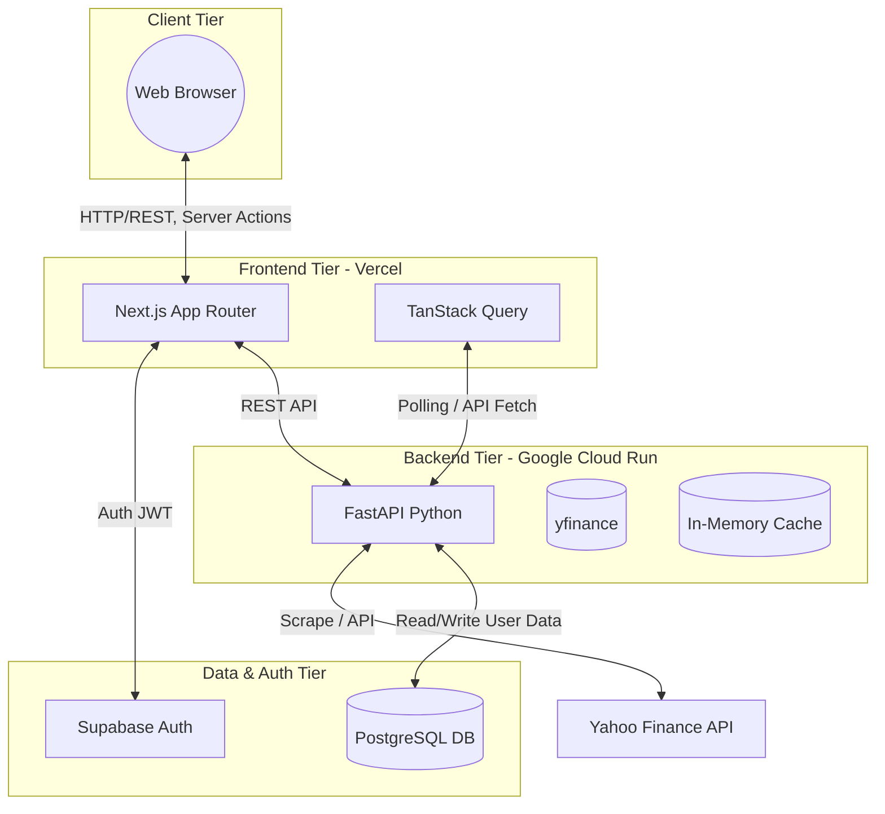
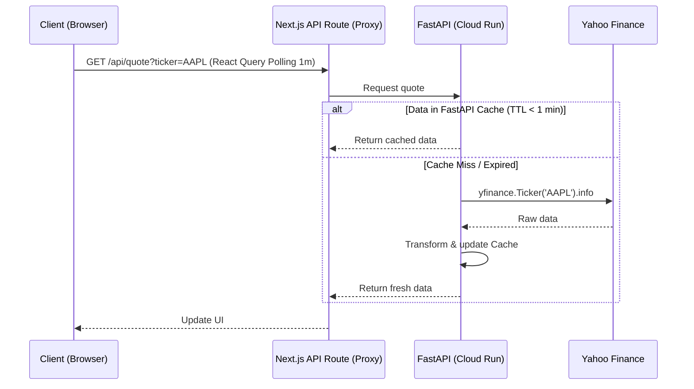

# Tech Stack & Technical Design - StockPulse (MVP)

Dokumen ini berisi rancangan arsitektur dan pilihan teknologi yang mendalam untuk proyek **StockPulse - Real-Time Stock Market Watcher**. Proyek ini difokuskan pada penyediaan antarmuka pengawasan saham secara *real-time* dengan budget infrastruktur gratis (100% Free Tier stack).

---

## 1. Tech Stack Overview

Berikut adalah tabel komprehensif teknologi yang digunakan di setiap *layer* sistem.

| Layer | Technology | Version | Purpose | Free Tier Limit | Alternative |
| --- | --- | --- | --- | --- | --- |
| **Frontend** | Next.js (App Router) | 14+ | React framework, SSR/SSG/ISR | 100GB Bandwidth, 1M Serverless Invocations (Vercel) | Remix, Vite + React |
| **Styling** | Tailwind CSS | 3.4+ | Utility-first CSS styling | N/A | Chakra UI, MUI |
| **Components** | shadcn/ui | Latest | Reusable accessible UI components | N/A | Radix UI raw |
| **Animations** | Magic UI | Latest | Animated landing page components | N/A | Framer Motion raw |
| **Charts** | Recharts | 2.x | Data visualization untuk grafik saham | N/A | Chart.js, Highcharts |
| **State Mgt** | Zustand | 4.x | Local client state management | N/A | Redux Toolkit, Context |
| **Data Fetch**| TanStack Query | 5.x | Caching, deduplication, fetching | N/A | SWR |
| **Backend** | Python / FastAPI | 3.11+ / 0.100+ | High-performance async API | 2M requests/month (Cloud Run) | Node.js/Express, Go |
| **Data Source**| yfinance | Latest | Fetching Yahoo Finance data | Rate-limited by Yahoo, unmetered lib | AlphaVantage, Polygon |
| **Validation**| Pydantic | v2 | Data validation & serialization | N/A | Marshmallow |
| **Scheduler** | APScheduler | 3.x | Background tasks for caching data | N/A | Celery |
| **Database** | Supabase (PostgreSQL)| Latest | Storage for users, watchlists | 500MB DB, 50k MAU Auth, 2GB Bandwidth | Neon, PlanetScale |
| **Hosting** | Vercel (Hobby) | N/A | Frontend edge network delivery | 100GB/mo | Netlify, Render |
| **Hosting** | Google Cloud Run | N/A | Backend Serverless container | 2M req/mo, 360k GB-sec/mo | Fly.io, Render, Railway |

### Frontend Stack Details
- **Next.js 14+ (App Router)**: Dipilih karena kemampuan Server-Side Rendering (SSR) dan *streaming* yang mempercepat *Initial Load Time*.
- **Tailwind CSS 3.4+**: Pendekatan *utility-first* mempermudah *rapid prototyping*.
- **shadcn/ui**: Menyediakan komponen dasar berbasis Radix UI tanpa *vendor lock-in*.
- **Magic UI**: Digunakan untuk elemen visual interaktif di *landing page*.
- **Recharts 2.x**: Stabil, berbasis React, cocok untuk grafik seri waktu (harga saham).
- **Lucide React**: Ringan dan modern untuk ikonografi.
- **TypeScript 5.x**: Meminimalisir *runtime errors* melalui *static typing*.
- **Zustand**: Sederhana dan efisien tanpa *boilerplate* berlebih seperti Redux.
- **TanStack Query (React Query)**: Menangani sinkronisasi data *polling* dan *caching* *market data*.
- **next-themes**: Dukungan instan untuk mode *Dark/Light*.
- **date-fns**: Manipulasi dan format tanggal (esensial untuk grafik dan *history* saham).

### Backend Stack Details
- **Python 3.11+**: Ekosistem data science/fintech terkuat.
- **FastAPI 0.100+**: Cepat, dukungan *async/await* penuh, auto-generasi OpenAPI/Swagger docs.
- **Pydantic v2**: Performanya kencang karena *core* dibangun menggunakan Rust.
- **yfinance**: *Web scraper* andal untuk Yahoo Finance API (karena ketersediaan data gratis).
- **uvicorn**: ASGI server performa tinggi.
- **httpx**: *Asynchronous HTTP client* bawaan untuk API *calls*.
- **APScheduler**: Digunakan jika diperlukan eksekusi *job* di *background* untuk *cache pre-warming*.
- **Docker**: Isolasi *environment* agar mudah di-*deploy* ke Cloud Run.

### Database & Storage (Supabase vs Neon)

Saat mengevaluasi Database Serverless untuk Free Tier, kandidat utamanya adalah **Supabase** dan **Neon**.

| Feature | Supabase (Postgres) | Neon (Serverless Postgres) |
| --- | --- | --- |
| **Core Value** | Backend-as-a-Service, Auth, Storage, Edge Functions | Branching DB (seperti Git), Scale-to-zero |
| **Free Tier Storage** | 500 MB DB | 500 MB DB |
| **Auth** | Built-in (GoTrue), Google OAuth, Magic Link | Tidak ada (harus pakai Clerk/Auth0) |
| **Real-time** | Real-time subscriptions (WebSockets) | Tidak ada bawaan |
| **API** | Auto-generated REST (PostgREST) | Hanya standar SQL koneksi |
| **SDK** | TypeScript SDK yang sangat kuat | Standar pg/postgres.js |
| **Connection Pooling**| PgBouncer / Supavisor bawaan | PgBouncer bawaan |

**Rekomendasi Utama: Supabase**
Supabase dipilih karena fitur yang disediakan sangat komprehensif untuk *startup/MVP*. Selain menyediakan PostgreSQL yang mumpuni, kita juga mendapatkan **Auth (Authentication)** bawaan secara cuma-cuma, serta *real-time subscriptions* yang berguna jika kita ingin me-*listen* perubahan *database* (misalnya notifikasi *alert* harga). Integrasinya sangat mulus dengan Next.js.

---

## 2. Architecture Deep Dive



### Layer Analysis & Cost
1. **Frontend (Vercel)**
   - *Why*: Vercel memberikan CI/CD instan (push-to-deploy) dan mengoptimasi Next.js secara *out-of-the-box*.
   - *Alternatives*: Netlify (serupa), Cloudflare Pages (kurang ideal untuk fitur *App Router* kompleks).
   - *Cost*: $0/bulan di bawah batas 100GB.
2. **Backend (Google Cloud Run)**
   - *Why*: *Serverless containers* yang bisa *scale-to-zero*. Tidak perlu membayar saat tidak ada *traffic*. Sangat cocok untuk *hobbyist*.
   - *Alternatives*: Render (Free tier *sleep* setelah 15 menit, butuh waktu lama untuk *cold start*), Fly.io (terkadang minta *credit card provision*).
   - *Cost*: $0/bulan. (Batas 2M *requests*, 360k GB-seconds per bulan).
3. **Database (Supabase)**
   - *Why*: Mengurangi kompleksitas mengintegrasikan Auth pihak ketiga. Free tier sangat berlebih untuk *MVP*.
   - *Alternatives*: Firebase (NoSQL tidak cocok untuk data terstruktur relasional seperti saham).
   - *Cost*: $0/bulan (hingga 50k MAU, 500MB data).

---

## 3. API Design

API Backend (FastAPI) berfokus sebagai *proxy* pintar antara aplikasi kita dan Yahoo Finance, ditambah manipulasi *watchlist* user.

### Endpoints

| Method | Endpoint | Description | Auth Req? |
| --- | --- | --- | --- |
| GET | `/api/v1/health` | Health check endpoint. | No |
| GET | `/api/v1/stocks/search?q={query}` | Mencari ticker berdasarkan string. | No |
| GET | `/api/v1/stocks/{ticker}/quote` | Mendapatkan data *quote* real-time/terakhir. | No |
| GET | `/api/v1/stocks/{ticker}/history?period={str}` | *Historical data* (1d, 1w, 1m, 3m, 1y). | No |
| GET | `/api/v1/stocks/batch?tickers={CSV}` | Data batch untuk *watchlist*. | No |
| GET | `/api/v1/watchlist` | Mendapatkan *watchlist* user. | Yes |
| POST | `/api/v1/watchlist` | Menambahkan *ticker* ke *watchlist*. | Yes |
| DELETE | `/api/v1/watchlist/{ticker}` | Menghapus *ticker* dari *watchlist*. | Yes |
| GET | `/api/v1/market/summary` | Top gainers, losers, index summaries. | No |

### Request/Response Schemas (Pydantic)

```python
from pydantic import BaseModel, Field
from typing import List, Optional

class StockQuoteResponse(BaseModel):
    ticker: str = Field(..., example="AAPL")
    current_price: float = Field(..., example=150.25)
    change: float = Field(..., example=2.5)
    change_percent: float = Field(..., example=1.6)
    market_cap: Optional[float] = None
    volume: Optional[int] = None
    timestamp: str

class WatchlistAddRequest(BaseModel):
    ticker: str = Field(..., example="MSFT", max_length=10)
```

### Rate Limiting & Caching Strategy (Backend)
- **Rate Limiting**: IP-based rate limiting (contoh: *SlowAPI* di FastAPI) dengan limit 60 requests/minute/IP.
- **yfinance Caching**: Sangat krusial agar IP Cloud Run kita tidak di-*ban* Yahoo. Kita akan implementasi *in-memory cache* (seperti `cachetools` TTL Cache):
  - *Quote data*: TTL 1 menit.
  - *History data*: TTL 1 jam atau 1 hari tergantung periode.
  - *Search/Summary*: TTL 10 menit.

---

## 4. Database Schema

Desain schema PostgreSQL di Supabase.

```sql
-- Users (Di-handle oleh Supabase Auth via auth.users, kita butuh trigger untuk public.users)
CREATE TABLE public.users (
    id UUID PRIMARY KEY REFERENCES auth.users(id) ON DELETE CASCADE,
    email TEXT UNIQUE NOT NULL,
    created_at TIMESTAMP WITH TIME ZONE DEFAULT NOW()
);

-- Stocks (Cache metadata ticker, opsional)
CREATE TABLE public.stocks (
    ticker VARCHAR(10) PRIMARY KEY,
    company_name VARCHAR(255) NOT NULL,
    sector VARCHAR(100),
    industry VARCHAR(100)
);

-- Watchlists (Relasi Many-to-Many antara users dan stocks)
CREATE TABLE public.watchlists (
    id UUID PRIMARY KEY DEFAULT uuid_generate_v4(),
    user_id UUID NOT NULL REFERENCES public.users(id) ON DELETE CASCADE,
    ticker VARCHAR(10) NOT NULL,
    created_at TIMESTAMP WITH TIME ZONE DEFAULT NOW(),
    UNIQUE(user_id, ticker)
);

-- Alerts (Untuk fitur notifikasi harga jika menyentuh target)
CREATE TABLE public.alerts (
    id UUID PRIMARY KEY DEFAULT uuid_generate_v4(),
    user_id UUID NOT NULL REFERENCES public.users(id) ON DELETE CASCADE,
    ticker VARCHAR(10) NOT NULL,
    target_price DECIMAL(10, 2) NOT NULL,
    condition VARCHAR(20) NOT NULL CHECK (condition IN ('ABOVE', 'BELOW')),
    is_active BOOLEAN DEFAULT TRUE,
    created_at TIMESTAMP WITH TIME ZONE DEFAULT NOW()
);

-- Indexes
CREATE INDEX idx_watchlists_user_id ON public.watchlists(user_id);
CREATE INDEX idx_alerts_user_is_active ON public.alerts(user_id, is_active);

-- Row Level Security (RLS)
ALTER TABLE public.watchlists ENABLE ROW LEVEL SECURITY;
CREATE POLICY "Users can only access their own watchlists" 
ON public.watchlists 
FOR ALL USING (auth.uid() = user_id);
```

---

## 5. Data Flow & Caching Strategy

Dikarenakan limitasi API gratis, kita tidak menggunakan *WebSockets* dari Yahoo ke backend. Strategi "Real-time" disimulasikan menggunakan **Smart Polling**.



**Rekomendasi Polling Interval:**
*Polling* setiap 1 - 2 menit pada jam operasional bursa (Market Hours) sangat optimal. Di luar jam bursa, hentikan *polling* atau tingkatkan interval menjadi 15 menit. *TanStack Query* mendukung ini melalui opsi `refetchInterval`.

---

## 6. Deployment Architecture

### Vercel (Next.js)
- Hubungkan *repository* GitHub ke Vercel.
- Framework: Terdeteksi otomatis sebagai Next.js.
- **Environment Variables**:
  - `NEXT_PUBLIC_API_URL` = `https://[cloud-run-url]/api/v1`
  - `NEXT_PUBLIC_SUPABASE_URL` = `https://[project-id].supabase.co`
  - `NEXT_PUBLIC_SUPABASE_ANON_KEY` = `[anon-key]`

### Google Cloud Run (FastAPI)
Menggunakan **Dockerfile**:
```dockerfile
FROM python:3.11-slim
WORKDIR /app
COPY requirements.txt .
RUN pip install --no-cache-dir -r requirements.txt
COPY . .
# Bind ke PORT dari environment (penting untuk Cloud Run)
CMD ["uvicorn", "app.main:app", "--host", "0.0.0.0", "--port", "8080"]
```
*Deployment* via CLI/Actions: `gcloud run deploy stockpulse-api --source . --region us-central1 --allow-unauthenticated`

---

## 7. Project Setup Checklist

Gunakan panduan *step-by-step* ini untuk inisiasi.

1. **Inisiasi Frontend**:
   ```bash
   npx create-next-app@latest frontend --typescript --tailwind --eslint --app
   cd frontend
   npx shadcn-ui@latest init
   npm install recharts zustand @tanstack/react-query date-fns lucide-react
   npm install @supabase/supabase-js
   ```
2. **Inisiasi Backend**:
   ```bash
   mkdir backend && cd backend
   python -m venv venv
   source venv/bin/activate # (Atau venv\Scripts\activate di Windows)
   pip install fastapi uvicorn pydantic yfinance httpx cachetools
   pip freeze > requirements.txt
   ```
3. **Konfigurasi Supabase**:
   - Buat proyek di [supabase.com](https://supabase.com).
   - Jalankan *SQL Script* dari bagian 4 di SQL Editor Supabase.
   - Ambil URL dan Anon Key, letakkan di `.env.local` frontend.
4. **Git Repository**:
   - Inisiasi git di *root folder* yang membawahi `frontend/` dan `backend/`.
   - Setup GitHub Actions (opsional untuk tahap MVP awal).

---

## 8. Development Environment

**Tools Required:**
- **IDE**: VS Code atau Cursor (sangat disarankan untuk *Vibe Coding*).
- **Extensions**: Python, Prettier, ESLint, Tailwind CSS IntelliSense, Thunder Client (API testing).
- **Local Dev**:
  - Frontend: `npm run dev` (berjalan di localhost:3000)
  - Backend: `uvicorn app.main:app --reload` (berjalan di localhost:8000)

**Hot Reload Config**:
*FastAPI* sudah memiliki fitur *hot-reload* bawaan melalui flag `--reload`. *Next.js* memiliki Fast Refresh bawaan. Pastikan CORS dikonfigurasi di FastAPI agar `localhost:3000` bisa memanggil `localhost:8000`.

---

## 9. Performance Optimization

1. **Next.js Optimization**:
   - Gunakan *Server Components* secara *default*. Hanya gunakan `'use client'` untuk komponen interaktif (seperti grafik *Recharts* dan tombol *Watchlist*).
   - Implementasikan *Streaming* menggunakan `loading.tsx` dan `Suspense`.
2. **API Response Optimization**:
   - Minimalkan *payload* yfinance. `yfinance` mengembalikan banyak metadata yang tidak perlu. Ekstrak hanya harga, persentase, dan volume.
   - Kompresi respons API (gunakan `GZipMiddleware` di FastAPI).
3. **Database Optimization**:
   - Indeks tabel `watchlists` pada `user_id` untuk mempercepat *query fetch* *dashboard* pengguna.
4. **Bundle Size**:
   - *Import* komponen tunggal, misalnya `import { format } from 'date-fns'` dibandingkan mengimpor seluruh *library*.
   - Evaluasi ukuran bundel dengan `@next/bundle-analyzer`.

---

## 10. Monitoring & Observability

Karena budget adalah $0 (Free Tier), kita manfaatkan *tools* gratis berikut:

- **Health Checks**: Endpoint `GET /api/v1/health` di-*ping* secara periodik oleh layanan gratis seperti UptimeRobot (interval 5 menit) untuk mencegah Cloud Run mengalami *cold start* parah (walaupun ini memakan kuota invokasi gratis, harus dikalkulasi dengan baik).
- **Error Tracking**: **Sentry** (Free Developer Tier) diintegrasikan di Frontend dan Backend untuk melacak *unhandled exceptions*.
- **Vercel Analytics**: Diaktifkan untuk analitik dasar trafik (tersedia gratis di paket Hobby).
- **Cloud Run Logs**: Menggunakan Google Cloud Logging bawaan yang sudah gratis untuk retensi dasar, memudahkan pencarian log eror *backend*.
