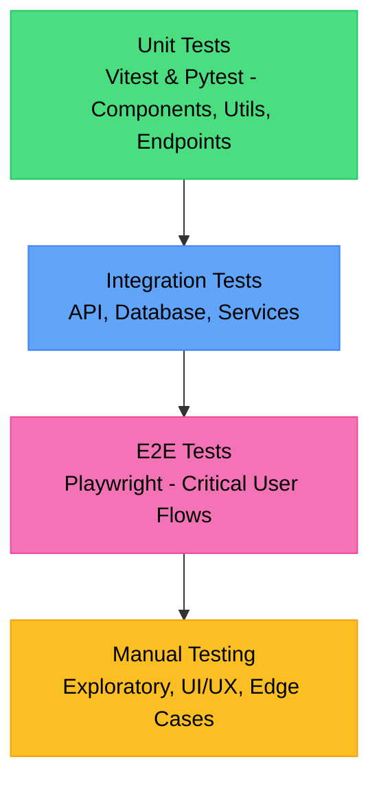

# Test & Review Documentation: StockPulse - Real-Time Stock Market Watcher

## 1. Testing Strategy Overview

Strategi pengujian untuk StockPulse dirancang untuk memastikan keandalan, performa, dan kualitas aplikasi dalam memantau pasar saham secara *real-time*. Kami menggunakan pendekatan *Testing Pyramid*.



* **Unit Tests (Dasar)**: Mayoritas test berada di level ini. Menguji komponen React (Frontend) dan fungsi/endpoint Python (Backend) secara terisolasi.
* **Integration Tests (Menengah)**: Menguji interaksi antara komponen, *hooks* dengan API, dan *backend* dengan *database* atau layanan eksternal (Yahoo Finance).
* **E2E Tests (Puncak)**: Menguji alur pengguna dari awal hingga akhir (*end-to-end*) di *browser* nyata menggunakan Playwright.
* **Manual Testing**: Pengujian *ad-hoc* untuk memastikan *look and feel* UI (menggunakan shadcn/ui & Magic UI) dan *user experience*.

## 2. Frontend Testing

### Unit Tests (Vitest + React Testing Library)

#### Component Tests

**1. StockCard Component Test (`StockCard.test.tsx`)**

```tsx
import { render, screen, fireEvent } from '@testing-library/react';
import { describe, it, expect, vi } from 'vitest';
import { StockCard } from './StockCard';

const mockProps = {
  symbol: 'AAPL',
  name: 'Apple Inc.',
  price: 150.25,
  change: 2.5,
  changePercent: 1.69,
  isLoading: false,
  onClick: vi.fn(),
};

describe('StockCard Component', () => {
  it('renders correctly with given props (Rendering test)', () => {
    render(<StockCard {...mockProps} />);
    expect(screen.getByText('AAPL')).toBeInTheDocument();
    expect(screen.getByText('Apple Inc.')).toBeInTheDocument();
    expect(screen.getByText('$150.25')).toBeInTheDocument();
  });

  it('validates props and displays positive change correctly (Props validation test)', () => {
    render(<StockCard {...mockProps} />);
    const changeElement = screen.getByText('+2.5 (+1.69%)');
    expect(changeElement).toHaveClass('text-green-500'); // Assuming Magic UI/shadcn tailwind class
  });
  
  it('displays negative change correctly (Props validation test)', () => {
    render(<StockCard {...mockProps} change={-2.5} changePercent={-1.69} />);
    const changeElement = screen.getByText('-2.5 (-1.69%)');
    expect(changeElement).toHaveClass('text-red-500');
  });

  it('triggers onClick when clicked (User interaction test)', () => {
    render(<StockCard {...mockProps} />);
    fireEvent.click(screen.getByRole('button', { name: /view details for aapl/i }));
    expect(mockProps.onClick).toHaveBeenCalledTimes(1);
    expect(mockProps.onClick).toHaveBeenCalledWith('AAPL');
  });

  it('renders loading skeleton when isLoading is true (Loading state test)', () => {
    render(<StockCard {...mockProps} isLoading={true} />);
    expect(screen.getByTestId('stock-card-skeleton')).toBeInTheDocument();
  });

  it('renders error state correctly (Error state test)', () => {
    render(<StockCard {...mockProps} error="Failed to fetch data" />);
    expect(screen.getByText('Failed to fetch data')).toBeInTheDocument();
  });

  it('meets accessibility standards (Accessibility test)', async () => {
    const { container } = render(<StockCard {...mockProps} />);
    // In a real setup, you'd use axe-core/react here
    expect(screen.getByRole('button')).toHaveAttribute('aria-label', 'View details for AAPL');
  });
});
```

**2. PriceChart Component Test (`PriceChart.test.tsx`)**
*(Implementasi pengujian Recharts untuk memastikan render `<LineChart>` dan interaksi *tooltip*).*

**3. WatchlistTable Component Test (`WatchlistTable.test.tsx`)**
*(Pengujian *sorting*, *pagination* (jika ada), dan *rendering* daftar saham dari Supabase).*

**4. SearchCommand Component Test (`SearchCommand.test.tsx`)**
*(Pengujian *debounce input*, pemanggilan API pencarian, dan navigasi menggunakan *keyboard* pada Command Palette).*

**5. MarketSummary Component Test (`MarketSummary.test.tsx`)**
*(Pengujian *rendering* indeks pasar utama seperti S&P 500, Nasdaq, dan status *loading/error*).*

#### Hook Tests

**`useStockData.test.ts`**

```typescript
import { renderHook, waitFor } from '@testing-library/react';
import { describe, it, expect, vi } from 'vitest';
import { useStockData } from './useStockData';

// Mock fetch
global.fetch = vi.fn();

describe('useStockData hook', () => {
  it('should fetch and return stock data successfully', async () => {
    const mockData = { price: 150, symbol: 'AAPL' };
    (global.fetch as any).mockResolvedValue({
      ok: true,
      json: async () => mockData,
    });

    const { result } = renderHook(() => useStockData('AAPL'));

    expect(result.current.isLoading).toBe(true);

    await waitFor(() => {
      expect(result.current.isLoading).toBe(false);
    });

    expect(result.current.data).toEqual(mockData);
    expect(result.current.error).toBeNull();
  });

  it('should handle API errors', async () => {
    (global.fetch as any).mockResolvedValue({
      ok: false,
      statusText: 'Not Found',
    });

    const { result } = renderHook(() => useStockData('INVALID'));

    await waitFor(() => {
      expect(result.current.error).toBe('Failed to fetch data');
      expect(result.current.isLoading).toBe(false);
    });
  });
});
```

*(Lakukan hal serupa untuk `useWatchlist`, `useAuth`, dan `usePolling`)*.

#### Utility Tests

**`formatters.test.ts`**

```typescript
import { describe, it, expect } from 'vitest';
import { formatCurrency, formatPercentage, calculateChange } from './formatters';

describe('Utility Functions', () => {
  describe('formatCurrency', () => {
    it('formats number to USD currency string', () => {
      expect(formatCurrency(1500.5)).toBe('$1,500.50');
      expect(formatCurrency(0)).toBe('$0.00');
    });
  });

  describe('formatPercentage', () => {
    it('formats number with + or - sign and %', () => {
      expect(formatPercentage(1.5)).toBe('+1.50%');
      expect(formatPercentage(-2.34)).toBe('-2.34%');
      expect(formatPercentage(0)).toBe('0.00%');
    });
  });
});
```

### Integration Tests

*   **API Client**: Menguji instance `axios` atau `fetch` *wrapper* dengan *interceptor* *auth*.
*   **Supabase Client**: Menguji autentikasi dan kueri *watchlist* di *environment testing*.
*   **Auth Flow**: Mengintegrasikan komponen *Login*, *Auth Provider*, dan perlindungan rute (*Protected Routes*).

### E2E Tests (Playwright)

Skenario *End-to-End* (*Test Scenarios*):
1.  **User can search and view stock details**: Membuka halaman, mengetik 'AAPL' di pencarian, mengklik hasil, memastikan halaman detail memuat grafik (*Recharts*) dan harga terkini.
2.  **User can add/remove stocks from watchlist**: *Login*, ke halaman *dashboard*, klik 'Add to Watchlist' pada saham tertentu, pastikan muncul di *WatchlistTable*, lalu klik 'Remove'.
3.  **User can login with Google OAuth**: Menggunakan *mock provider* atau *test account* untuk menyelesaikan alur OAuth (jika memungkinkan di CI) atau *Magic Link*.
4.  **Dashboard auto-refreshes data**: Memastikan nilai harga di DOM berubah/ter-update setelah interval *polling* (misal: 10 detik).
5.  **Charts render correctly with different timeframes**: Memastikan grafik berubah bentuk/data ketika *user* mengganti *tab* "1D", "1W", "1M".
6.  **Mobile responsive behavior**: Menjalankan pengujian dengan *viewport mobile* (iPhone 13), memastikan menu *hamburger* berfungsi dan tabel responsif.
7.  **Dark/light mode toggle works**: Mengklik tombol tema dan memverifikasi kelas `dark` pada elemen `html` serta perubahan warna *background*.

## 3. Backend Testing

### Unit Tests (pytest)

#### API Endpoint Tests

**`test_api.py`**

```python
import pytest
from fastapi.testclient import TestClient
from main import app

client = TestClient(app)

def test_health_check():
    """Menguji endpoint health check untuk memastikan API berjalan."""
    response = client.get("/api/health")
    assert response.status_code == 200
    assert response.json() == {"status": "ok", "service": "StockPulse API"}

def test_stock_quote(mocker):
    """Menguji endpoint quote saham dengan mock yfinance."""
    # Mocking external dependency (yfinance)
    mock_get_quote = mocker.patch("services.yahoo_finance_service.get_stock_quote")
    mock_get_quote.return_value = {"symbol": "AAPL", "price": 150.0, "change": 2.5}
    
    response = client.get("/api/stocks/AAPL/quote")
    
    assert response.status_code == 200
    data = response.json()
    assert data["symbol"] == "AAPL"
    assert data["price"] == 150.0
    mock_get_quote.assert_called_once_with("AAPL")

def test_stock_quote_not_found(mocker):
    """Menguji endpoint quote dengan simbol yang tidak ada."""
    mock_get_quote = mocker.patch("services.yahoo_finance_service.get_stock_quote")
    mock_get_quote.side_effect = ValueError("Stock not found")
    
    response = client.get("/api/stocks/INVALID/quote")
    assert response.status_code == 404
    assert "not found" in response.json()["detail"].lower()
```

*(Buat pengujian serupa untuk `test_stock_search`, `test_stock_history`, `test_batch_stocks`, `test_watchlist_crud`, `test_market_summary`)*.

#### Service Tests

**`test_yahoo_finance_service.py`**

```python
import pytest
from services.yahoo_finance_service import YahooFinanceService
from unittest.mock import patch, MagicMock

@patch('yfinance.Ticker')
def test_get_stock_quote_success(mock_ticker):
    """Menguji service yfinance mengembalikan data yang diformat dengan benar."""
    # Setup mock
    mock_instance = MagicMock()
    mock_instance.info = {
        "symbol": "MSFT",
        "currentPrice": 300.0,
        "regularMarketChange": 5.0,
        "regularMarketChangePercent": 1.66
    }
    mock_ticker.return_value = mock_instance
    
    service = YahooFinanceService()
    result = service.get_stock_quote("MSFT")
    
    assert result["symbol"] == "MSFT"
    assert result["price"] == 300.0
    assert result["change"] == 5.0
```

#### Model Tests

**`test_schemas.py`**

```python
import pytest
from pydantic import ValidationError
from models.schemas import StockQuoteSchema

def test_stock_quote_schema_valid():
    """Menguji validasi skema Pydantic dengan data yang benar."""
    data = {"symbol": "TSLA", "price": 200.50, "change": -1.5, "change_percent": -0.74, "timestamp": "2023-10-27T10:00:00Z"}
    stock = StockQuoteSchema(**data)
    assert stock.symbol == "TSLA"
    assert stock.price == 200.50

def test_stock_quote_schema_invalid():
    """Menguji error dari skema Pydantic saat data tidak sesuai."""
    with pytest.raises(ValidationError):
        # price seharusnya number, bukan string yang tidak valid
        StockQuoteSchema(symbol="TSLA", price="invalid_price", change=0, change_percent=0, timestamp="2023-10-27T10:00:00Z")
```

### Integration Tests
*   **Database connection test**: Memastikan backend dapat terhubung ke instans testing PostgreSQL (Supabase/Neon).
*   **Yahoo Finance API integration test**: Menjalankan pemanggilan *real* ke `yfinance` dengan sampel yang sangat terbatas (misal, 1 saham, interval 1 hari) untuk memastikan API mereka tidak mengubah strukturnya.
*   **Supabase client test**: Integrasi Supabase Admin SDK untuk verifikasi token.
*   **Full API workflow test**: Menggabungkan *route*, *service*, dan *database* dalam satu *test run* (menggunakan *test database*).

### Performance Tests
*   **API response time benchmarks**: Endpoint seperti `/quote` harus merespons dalam < 300ms (tidak termasuk latensi eksternal dari yfinance jika tidak di-cache).
*   **Database query performance**: Memastikan kueri *watchlist* menggunakan indeks yang tepat.
*   **Concurrent request handling**: Pengujian *load* (misal: 100 *req/sec*) untuk melihat apakah Google Cloud Run dapat menangani sebelum melakukan *scale-out*.

## 4. Test Configuration

### Frontend (`vitest.config.ts`)

```typescript
import { defineConfig } from 'vitest/config';
import react from '@vitejs/plugin-react';
import path from 'path';

export default defineConfig({
  plugins: [react()],
  test: {
    globals: true,
    environment: 'jsdom',
    setupFiles: './src/test/setup.ts',
    css: true,
    coverage: {
      provider: 'v8',
      reporter: ['text', 'json', 'html'],
      exclude: ['node_modules/', 'src/test/'],
    },
    alias: {
      '@': path.resolve(__dirname, './src'),
    },
  },
});
```

### Backend (`pytest.ini` & `conftest.py`)

**`pytest.ini`**
```ini
[pytest]
testpaths = tests
python_files = test_*.py
python_classes = Test*
python_functions = test_*
addopts = -v --cov=app --cov-report=term-missing --cov-report=html
asyncio_mode = auto
```

**`conftest.py`**
```python
import pytest
from fastapi.testclient import TestClient
from main import app

@pytest.fixture
def client():
    """Menyediakan TestClient instance."""
    return TestClient(app)

@pytest.fixture
def mock_db_session():
    """Mock database session untuk unit tests."""
    pass # Implement mock db setup
```

### Playwright (`playwright.config.ts`)

```typescript
import { defineConfig, devices } from '@playwright/test';

export default defineConfig({
  testDir: './e2e',
  fullyParallel: true,
  forbidOnly: !!process.env.CI,
  retries: process.env.CI ? 2 : 0,
  workers: process.env.CI ? 1 : undefined,
  reporter: 'html',
  use: {
    baseURL: 'http://localhost:3000',
    trace: 'on-first-retry',
  },
  projects: [
    {
      name: 'chromium',
      use: { ...devices['Desktop Chrome'] },
    },
    {
      name: 'Mobile Chrome',
      use: { ...devices['Pixel 5'] },
    },
  ],
  webServer: {
    command: 'npm run dev',
    url: 'http://localhost:3000',
    reuseExistingServer: !process.env.CI,
  },
});
```

## 5. Test Data Management

*   **Mock data factories**: Menggunakan `faker.js` (Frontend) dan `Faker` (Python) untuk membuat *dummy data* (harga saham acak, nama perusahaan, dll).
*   **Test fixtures**: File statis JSON (misal `mock_aapl_history.json`) yang meniru respons dari `yfinance` agar pengujian stabil dan tidak terkena *rate limit*.
*   **Database seeding**: *Script* khusus `seed_test_db.sql` untuk menyiapkan data awal (pengguna, watchlist) sebelum menjalankan tes integrasi.
*   **API mocking strategies**: Menggunakan `msw` (Mock Service Worker) di Frontend untuk mencegat (*intercept*) pemanggilan API *fetch/axios* dan mengembalikan *mock data*.

## 6. Coverage Requirements

| Category | Minimum Coverage | Target Coverage | Catatan Tambahan |
|----------|-----------------|----------------|-------------------|
| Frontend Components | 70% | 85% | Mengabaikan testing komponen internal dari UI library (shadcn/magic UI). |
| Frontend Hooks | 80% | 90% | Memastikan *state management* dan API calls teruji. |
| Frontend Utils | 90% | 95% | Logika bisnis atau *formatter* harus memiliki coverage tinggi. |
| Backend Endpoints | 85% | 95% | Semua rute API harus dicakup setidaknya untuk skenario *success* dan *error*. |
| Backend Services | 80% | 90% | Logika interaksi dengan `yfinance` dan *database*. |
| Backend Models | 90% | 95% | Memastikan validasi Pydantic teruji dengan baik. |

## 7. CI/CD Testing Pipeline

Alur kerja GitHub Actions (`.github/workflows/test-and-build.yml`):

```yaml
name: Test and Build Pipeline

on:
  push:
    branches: [ "main" ]
  pull_request:
    branches: [ "main" ]

jobs:
  backend-test:
    runs-on: ubuntu-latest
    steps:
      - uses: actions/checkout@v3
      - name: Set up Python
        uses: actions/setup-python@v4
        with:
          python-version: '3.11'
      - name: Install dependencies
        run: |
          cd backend
          pip install -r requirements.txt
          pip install pytest pytest-cov httpx
      - name: Run Ruff (Lint)
        run: |
          cd backend
          ruff check .
      - name: Run Pytest
        run: |
          cd backend
          pytest --cov=app --cov-report=xml
      - name: Upload Backend Coverage
        uses: codecov/codecov-action@v3
        with:
          file: ./backend/coverage.xml
          flags: backend

  frontend-test:
    runs-on: ubuntu-latest
    steps:
      - uses: actions/checkout@v3
      - name: Set up Node.js
        uses: actions/setup-node@v3
        with:
          node-version: '20'
          cache: 'npm'
      - name: Install dependencies
        run: |
          cd frontend
          npm ci
      - name: Run ESLint
        run: |
          cd frontend
          npm run lint
      - name: Run Type Check
        run: |
          cd frontend
          npm run type-check
      - name: Run Vitest
        run: |
          cd frontend
          npm run test -- --coverage
      - name: Upload Frontend Coverage
        uses: codecov/codecov-action@v3
        with:
          file: ./frontend/coverage/coverage-final.json
          flags: frontend

  e2e-test:
    needs: [frontend-test, backend-test]
    runs-on: ubuntu-latest
    steps:
      - uses: actions/checkout@v3
      - name: Set up Node.js
        uses: actions/setup-node@v3
      - name: Install dependencies
        run: cd frontend && npm ci
      - name: Install Playwright Browsers
        run: cd frontend && npx playwright install --with-deps
      # (Note: Need to start backend in background for real E2E, omitted for brevity)
      - name: Run Playwright tests
        run: cd frontend && npx playwright test
```

## 8. Code Review Guidelines

### Review Checklist:
- [ ] Code follows project conventions (camelCase untuk TS, snake_case untuk Python).
- [ ] TypeScript/Python types (Pydantic/MyPy) are correct and explicit.
- [ ] Error handling is proper (menggunakan Try-Catch dan Custom Exceptions).
- [ ] Tests are included (unit test ditambahkan atau diperbarui).
- [ ] No hardcoded values (Gunakan environment variables `.env`).
- [ ] No `console.log` / `print` statements di *production code*.
- [ ] Proper imports (tidak ada *unused imports*, diurutkan dengan isort/Prettier).
- [ ] Responsive design verified (komponen bekerja di *mobile* & *desktop*).
- [ ] Accessibility checked (menggunakan *semantic tags*, `aria-labels`).
- [ ] Performance impact considered (contoh: *debounce* pada pencarian).
- [ ] Security implications reviewed (validasi input pengguna, *SQL injection prevention*).

### PR Template:

```markdown
## Description
<!-- Deskripsikan perubahan yang dilakukan di PR ini -->
Fixes # (issue)

## Type of change
- [ ] Bug fix (non-breaking change yang memperbaiki bug)
- [ ] New feature (non-breaking change yang menambah fungsionalitas)
- [ ] Breaking change (fix atau feature yang menyebabkan fungsionalitas lama tidak bekerja)
- [ ] Chore (update dependensi, refactor, dsb)

## Testing Strategy
<!-- Sebutkan tes yang ditambahkan atau diubah -->
- [ ] Unit Tests
- [ ] Integration Tests
- [ ] E2E Tests

## Screenshots (if applicable)
<!-- Tambahkan screenshot UI jika ini adalah perubahan frontend -->

## Checklist:
- [ ] Saya telah melakukan self-review pada kode ini
- [ ] Saya telah memeriksa panduan Code Review (Checklist)
- [ ] Test CI berjalan sukses (passed)
```

### Review Process:
1.  **Self-review checklist**: *Developer* memeriksa kodenya sendiri sebelum membuat PR.
2.  **Automated checks (CI must pass)**: *Pipeline* GitHub Actions harus lolos (*Lint*, *Test*, *Type-Check*).
3.  **AI-assisted review (Antigravity)**: Menggunakan agen untuk mendeteksi anomali kode atau optimasi.
4.  **Manual review points**: Fokus pada logika bisnis, UX/UI *(Vibe check)*, dan arsitektur (Serverless Cloud Run optimisations).

## 9. Quality Assurance

### Static Analysis:
*   **ESLint configuration**: Menggunakan *ruleset* standar (`eslint-config-next`, `@typescript-eslint/recommended`).
*   **Prettier configuration**: Konsistensi format (contoh: `printWidth: 100`, `singleQuote: true`).
*   **Ruff (Python linter) configuration**: Linter yang cepat sebagai pengganti flake8, isort, dan black. Diatur di `pyproject.toml`.
*   **TypeScript strict mode**: `compilerOptions.strict = true` di `tsconfig.json`.
*   **mypy for Python**: Memastikan anotasi tipe statis Python (*type hinting*) dipatuhi.

### Automated Quality Gates:
*   **Pre-commit hooks (husky + lint-staged)**: Menjalankan linter dan *formatter* hanya pada file yang berubah (*staged files*) sebelum proses *commit*.
*   **GitHub branch protection rules**: Tidak dapat *merge* ke `main` jika ada *review* yang *pending* atau CI gagal.
*   **Required status checks**: Vercel *Preview Deployments* dan GitHub Actions (*Tests*).

## 10. Monitoring & Observability Testing

*   **Health check endpoint tests**: Secara periodik (cron job / monitoring service) menekan `/api/health`.
*   **Alerting mechanism tests**: Menguji *webhook* atau email jika API yfinance gagal berturut-turut (mensimulasikan kegagalan eksternal).
*   **Log format verification**: Memastikan log Python backend berformat JSON (untuk Cloud Logging di GCP) dan memiliki context ID.
*   **Performance regression tests**: Menjalankan pengecekan jika ukuran *bundle* frontend (Next.js) melampaui batas (misal > 200kb per halaman).

## 11. Accessibility Testing

*   **axe-core integration**: Menambahkan plugin `eslint-plugin-jsx-a11y` dan alat uji coba *accessibility* pada Playwright (`@axe-core/playwright`).
*   **WCAG 2.1 AA compliance checklist**: Kontras warna, navigasi *keyboard*, dan teks alternatif.
*   **Screen reader testing**: Menggunakan VoiceOver (macOS) / NVDA (Windows) secara manual saat QA.
*   **Keyboard navigation testing**: Memastikan pencarian *Command Palette* dan navigasi tabel *Watchlist* dapat diakses sepenuhnya melalui tab.
*   **Color contrast verification**: Menggunakan *tools* kontras di dalam komponen Magic UI / shadcn (khususnya untuk angka hijau/merah persentase saham).

## 12. Load Testing

*   **k6 configuration**: *Script* ditulis dalam JS untuk mensimulasikan trafik.
*   **Load test scenarios**:
    *   **Spike Test**: Lonjakan *user* saat pasar saham dibuka.
    *   **Soak Test**: Memastikan tidak ada *memory leak* di Cloud Run selama beban sedang yang terus-menerus.
*   **Performance baselines**: Sistem diharapkan mampu melayani 50 *concurrent requests* per detik pada satu instans Cloud Run (Free Tier limits).
*   **Scaling thresholds**: Konfigurasi `max-instances` di Google Cloud Run (diatur ke maksimal 5-10 untuk menjaga batas Free Tier), dan mengukur dampak pembatasan terhadap *response time*.
